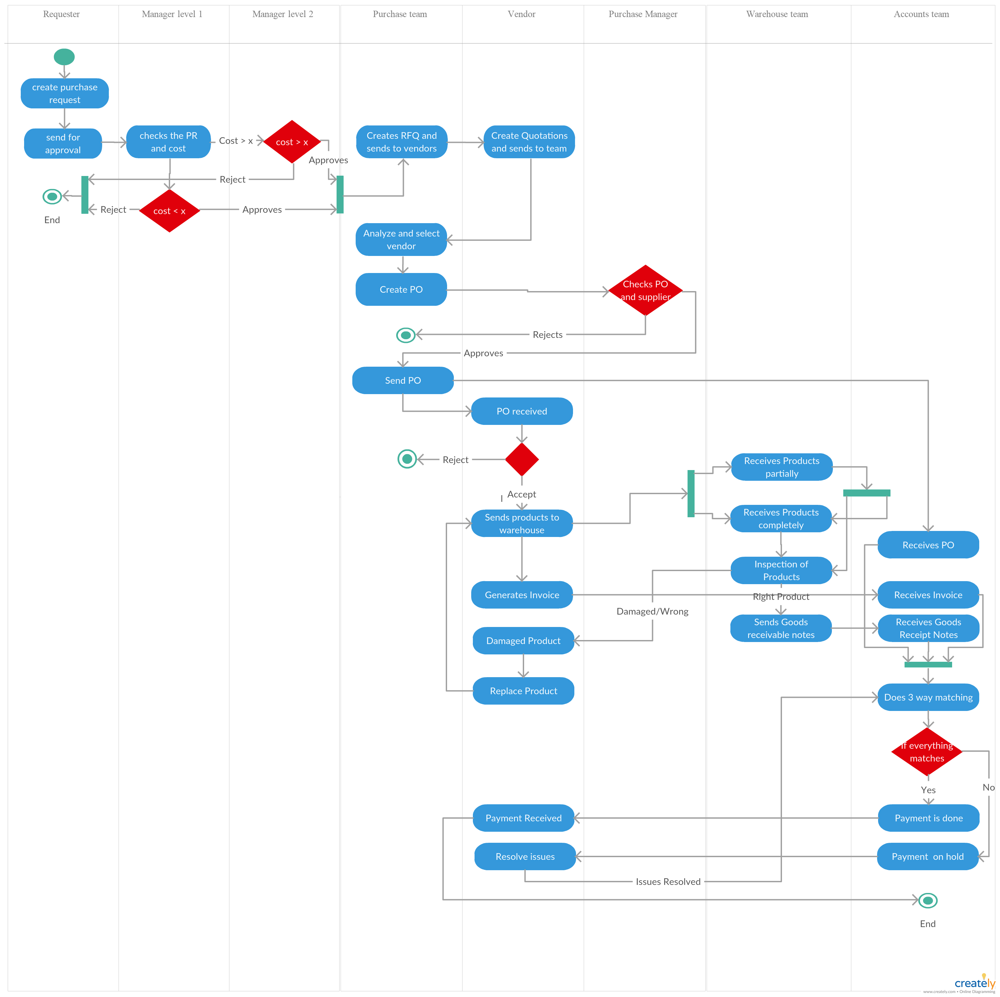

# Workflow

## Overview

The Procure-to-Pay workflow defines the end-to-end movement of a procurement request from initiation to final payment. Each stage is governed by system-driven transitions, role-based actions, and validation rules to ensure control and accuracy.

---

## Process Flow

The diagram illustrates the complete procurement lifecycle across stakeholders, including Requester, Manager, Purchase Team, Vendor, Purchase Manager, Warehouse, and Accounts.

It captures:

- Sequential flow of procurement activities  
- Approval checkpoints based on cost thresholds  
- Vendor interaction and decision points  
- Goods receipt and inspection handling  
- Invoice validation and payment processing  

The swimlane structure highlights role-based responsibilities and ensures clear ownership at each stage of the process.

---

## End-to-End Flow

Purchase Request → Approval → RFQ → Vendor Selection →  
Purchase Order Creation → PO Approval → PO Dispatch →  
Goods Receipt → Inspection → GRN Generation →  
Invoice Upload → Three-Way Matching → Payment Processing  

---

## Stage Breakdown

### 1. Purchase Request
- Requester creates and submits purchase request  
- System validates inputs and routes for approval  

### 2. Approval
- Manager reviews request  
- Approval or rejection based on cost threshold  

### 3. RFQ and Vendor Interaction
- RFQ sent to vendors  
- Vendor quotations collected  

### 4. Vendor Selection
- Quotes evaluated  
- Vendor selected with justification  

### 5. Purchase Order Creation
- PO created with system-calculated values  
- Submitted for approval  

### 6. Purchase Order Approval
- Purchase Manager reviews PO  
- Approval enables vendor dispatch  

### 7. PO Dispatch
- PO sent to vendor  
- Status updated for tracking  

### 8. Goods Receipt
- Warehouse records delivery  
- Partial receipt supported  

### 9. Inspection and GRN
- Goods inspected  
- GRN generated for accepted quantity  
- Rejected items trigger replacement  

### 10. Invoice Processing
- Invoice uploaded and linked to PO and GRN  

### 11. Three-Way Matching
- System compares PO, GRN, and Invoice  
- Mismatch leads to payment hold  

### 12. Payment Processing
- Payment completed after successful validation  

---

## Workflow Controls

- All transitions are system-driven  
- Status updates automatically based on actions  
- Financial values are system-calculated  
- Approval decisions are recorded  
- Payment is blocked in case of mismatch  

---

## Traceability

Each transaction is linked through system-generated references:

- PR Number → PO Number → GRN → Invoice  

This ensures complete visibility and audit traceability across the procurement lifecycle.

---

## Supporting Documentation

Detailed requirements and validation logic are available in the documentation section of this repository.
