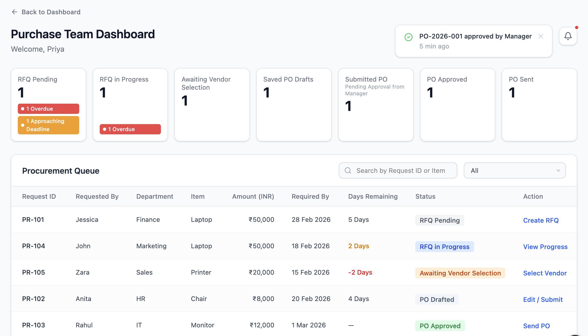

# Purchase Team Dashboard

This dashboard acts as the operational control center for the Purchase Team after PR approval. It enables tracking and execution of procurement activities from RFQ initiation to Purchase Order completion.

---

## Flow Position

PR Creation → PR Approval → **Purchase Team Dashboard** → RFQ → Vendor Selection → PO Creation → PO Approval

---

## Dashboard Screen

---

## Overview

The Purchase Team Dashboard provides visibility into all procurement requests and their current stage in the workflow. It enables efficient tracking, prioritization, and execution of downstream procurement actions.

---

## Workflow Status Cards

Requests are categorized into the following stages:

- RFQ Pending  
- RFQ In Progress  
- Awaiting Vendor Selection  
- Saved PO Drafts  
- Submitted PO (Pending Approval)  
- PO Approved  
- PO Sent  
- Replacement Required  

Each card dynamically filters the data grid based on the selected stage.

---

## Data Grid Structure

Each record displays:

- PR Number  
- Requested By  
- Department  
- Item  
- Amount  
- Required By Date  
- Days Remaining (auto-calculated)  
- Status  
- Action  

---

## Key Functional Logic

- Approved PRs automatically move to **RFQ Pending**
- RFQ creation updates status to **RFQ In Progress**
- Vendor selection requires recorded quotations
- PO submission moves request to **Pending Approval**
- After approval, Purchase Team can **Send PO to Vendor**
- Replacement workflow is triggered for rejected or failed fulfillment

---

## Automation & Governance

- Workflow transitions are system-driven and sequential  
- Status cannot be manually overridden  
- Financial values remain consistent across stages  
- Only approved POs enable “Send PO” action  
- Ensures structured and controlled procurement execution  
