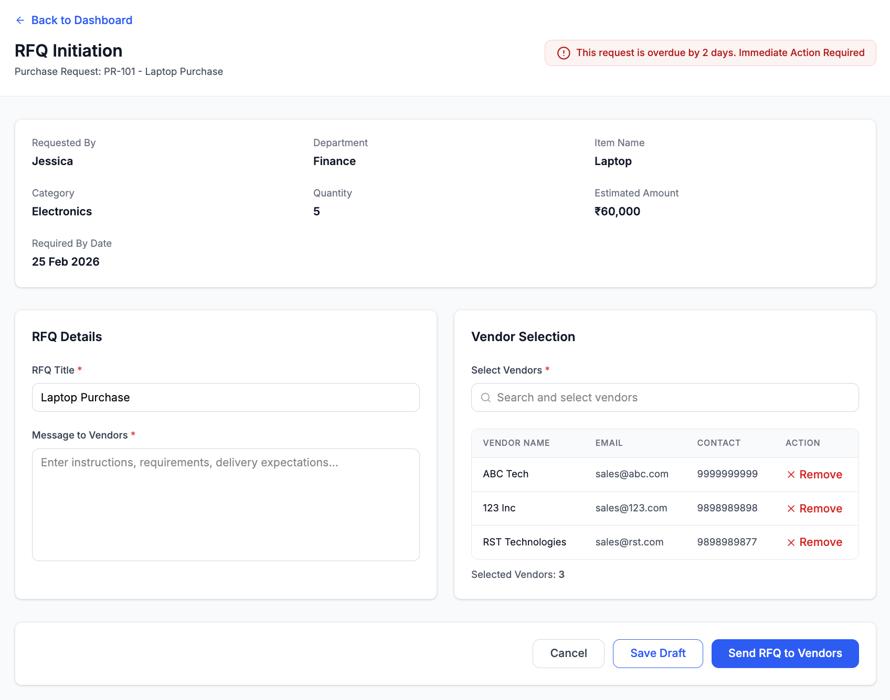

# RFQ Creation (RFQ Initiation)

## Module

Purchase Execution

---

## Overview

The RFQ Initiation screen enables users to formally request quotations from selected vendors for an approved Purchase Request (PR). This marks the transition from internal approval to external vendor engagement.

---

## Workflow Context

PR Approved → RFQ Creation → RFQ Management → Vendor Selection

---

## Wireframe

---

## Key Components

- **PR Summary (Read-Only)**  
  Displays approved request details including item, quantity, and estimated amount.

- **RFQ Details Section**  
  Captures RFQ title, vendor instructions, and communication details.

- **Vendor Selection Section**  
  Allows selection of one or more vendors from the predefined vendor list.

- **Send RFQ Action**  
  Initiates vendor communication once all validations are satisfied.

---

## Layout and Sections

### 1. Header

- Back to Dashboard (navigation link)  
- Page Title: RFQ Initiation  
- Purchase Request Reference (e.g., PR-101 - Laptop Purchase)  
- Overdue warning (if applicable)  

---

### 2. Purchase Request Summary (Read-only)

Displays key PR details:

- Requested By  
- Department  
- Item Name  
- Category  
- Quantity  
- Estimated Amount  
- Required By Date  

---

### 3. RFQ Details

- RFQ Title (required, pre-filled from PR)  
- Message to Vendors (required multi-line input)  

---

### 4. Vendor Selection

- Vendor selection dropdown (multi-select)  
- Add Vendor option  

#### Selected Vendors Table:

- Vendor Name  
- Email  
- Contact  
- Action (Remove)  

- Selected Vendors Count  

---

### 5. Actions

- Cancel  
- Save Draft  
- Send RFQ to Vendors (Primary CTA)  

---

## System Logic

- PR details are auto-populated and read-only  
- RFQ Title is pre-filled from PR but editable  
- Vendor list is fetched from vendor master data  
- Selected vendors are dynamically added to the table  
- Removing a vendor updates the selection instantly  

---

## Automation & System Logic

- RFQ is auto-saved as Draft upon creation  
- Approved PR details are auto-populated and locked (non-editable)  
- RFQ cannot be sent unless:
  - All mandatory RFQ fields are completed  
  - At least one vendor is selected  
- Upon sending RFQ, status updates to **RFQ In Progress**  

---

## Validation Rules

- RFQ Title is mandatory  
- Message to Vendors is mandatory  
- At least one vendor must be selected  
- "Send RFQ" is enabled only when all required fields are valid  

---

## Business Rules

- RFQ can only be created for approved PRs  
- Multiple vendors can be selected for a single RFQ  
- RFQ must be sent to at least one vendor  
- Draft RFQs can be saved without full validation  

---

## Edge Cases

- No vendors available → Show empty state with “Add Vendor” option  
- No vendor selected → Disable submission  
- Missing mandatory fields → Show validation errors  
- Overdue PR → Display warning message  

---

## Workflow Behavior

- Save Draft → Saves RFQ without sending to vendors  
- Send RFQ → Moves RFQ to RFQ Management stage  
- Cancel → Navigates back to dashboard  

---

## Workflow Progression

- RFQ Pending → RFQ In Progress (once RFQ is created and sent)  
- Quote recording moves the request toward **Awaiting Vendor Selection**  
- Vendor selection triggers **PO creation**  

---

## Governance Controls

- Vendor selection is mandatory before RFQ dispatch  
- Workflow transitions are sequential and system-controlled  
- RFQ cannot bypass required steps  

---

## Key Observations

- Ensures structured vendor communication  
- Prevents incomplete RFQ submission  
- Enables multi-vendor engagement  
- Maintains linkage between PR and RFQ  
