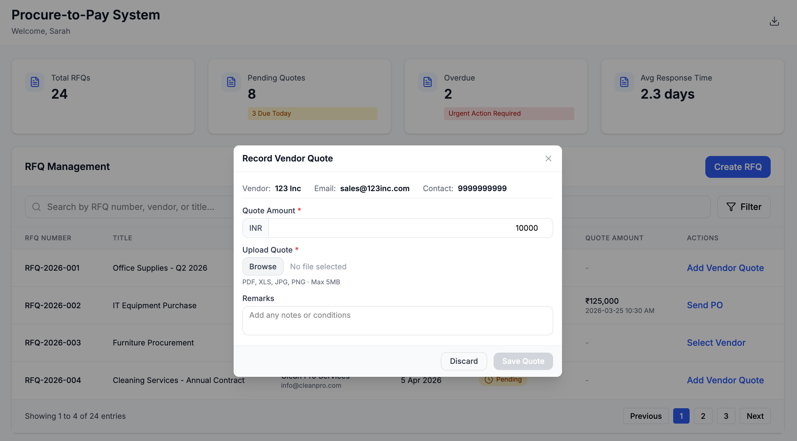

# Screen: RFQ Management

## Module: Purchase Execution

---

## Overview

The RFQ Management screen enables the Purchase Team to monitor vendor responses, record quotations, and control progression toward vendor selection.

This ensures structured quote comparison, audit traceability, and decision readiness before Purchase Order creation.

---

## Wireframe

---

## Layout and Sections

### 1. RFQ Context (Header Section)

The header provides high-level visibility into the RFQ:

- Purchase Request Number
- RFQ ID
- Required By Date
- Days Remaining (auto-calculated)
- RFQ Sent Date
- RFQ Status (e.g., In Progress)

**System Behavior:**
- "Days Remaining" is dynamically calculated based on Required By Date.

---

### 2. Vendor Responses Section

Displays all invited vendors and their response status.

**Table includes:**
- Vendor Name
- RFQ Sent Status
- Response Status
- Quoted Amount
- Uploaded Quote Document
- Actions

**Default State:**
- Vendors initially appear as **Awaiting Response**

---

### 3. Actions & Controls

Users can:

- Add Vendor Quote
- Edit existing quote
- Delete quote
- View uploaded documents
- Add additional vendor responses

---

### 4. Footer Actions

- **Cancel** → Navigate back
- **Proceed to Vendor Selection** → Enabled only when valid quotes exist

---

## Quote Recording Logic

When a vendor quote is received:

- Purchase Team records the quote amount
- Uploads supporting quotation document
- Status automatically updates to **Quote Recorded**
- Status is system-controlled and cannot be manually overridden

---

## Progression Control

- "Proceed to Vendor Selection" becomes available only when:
  - At least one vendor quote is recorded
  - Required documentation is available
- Additional quotes can be recorded before moving forward
- RFQ remains in **In Progress** status until manually advanced

---

## Automation & System Behavior

- RFQ data auto-saves during updates
- Days Remaining is dynamically calculated
- Quote entries are time-stamped for audit tracking
- Workflow transitions are sequential and system-driven
- Direct progression to PO creation is restricted without vendor selection

---

## Governance & Controls

- Quote cannot be saved without:
  - Quote amount
  - Supporting document
- Duplicate vendor entries are prevented
- Status cannot be manually modified
- RFQ stage progression is controlled by system rules

---

## Edge Cases

- No vendor response → RFQ remains active
- Partial responses → Only available quotes considered
- Missing document → Prevent submission
- Duplicate vendor quote → Blocked
- Expired RFQ → Marked overdue

---

## Workflow Transition

- Add Vendor Quote → Opens quote entry modal
- Proceed to Vendor Selection → Navigates to Vendor Selection screen
- Cancel → Returns to previous screen

---

# Sub-Screen: Record Vendor Quote

## Overview

This modal enables the Purchase Team to capture quotation details received from vendors and upload supporting documents.

---

## Wireframe

---

## Layout and Sections

### 1. Vendor Information (Read-Only)

Auto-populated fields:

- Vendor Name
- Vendor Contact Details

**Behavior:**
- These fields are locked and non-editable

---

### 2. Quote Details Captured

**Mandatory Fields:**
- Quote Amount
- Upload Quotation Document

**Optional Field:**
- Remarks

---

### 3. Supported File Formats

Accepted formats:

- PDF
- XLS / XLSX
- JPG
- PNG

**System Validation:**
- File type validation enforced
- File size restriction applied

---

## Automation & Status Update

Upon successful save:

- Vendor response status updates to **Quote Recorded**
- Quoted amount reflects in RFQ Management table
- Timestamp is captured for audit tracking
- Status cannot be manually modified

---

## Governance Controls

- Quote cannot be saved without required fields
- Duplicate entries for same vendor are restricted
- Saving a quote does NOT automatically advance RFQ stage
