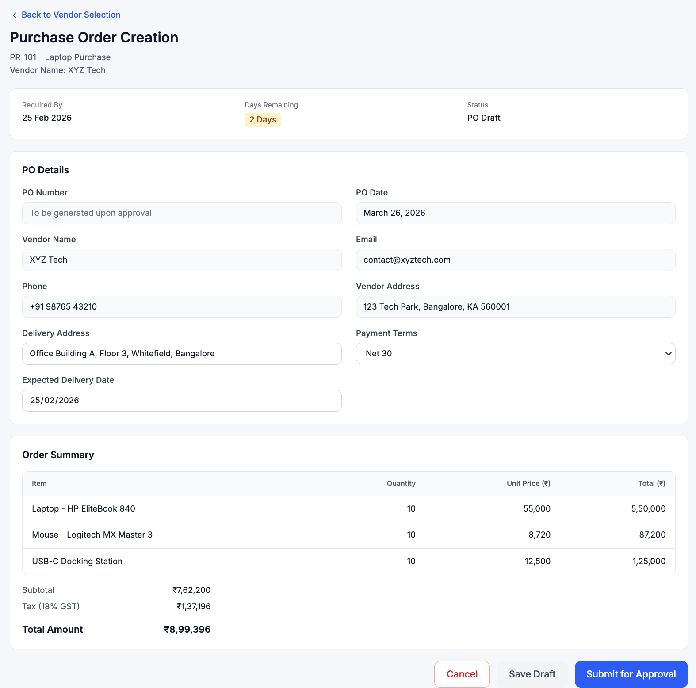
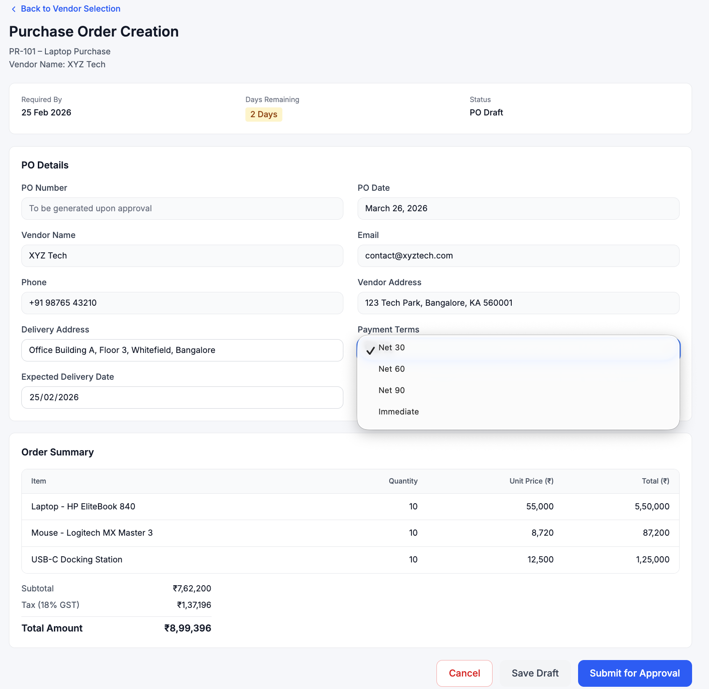
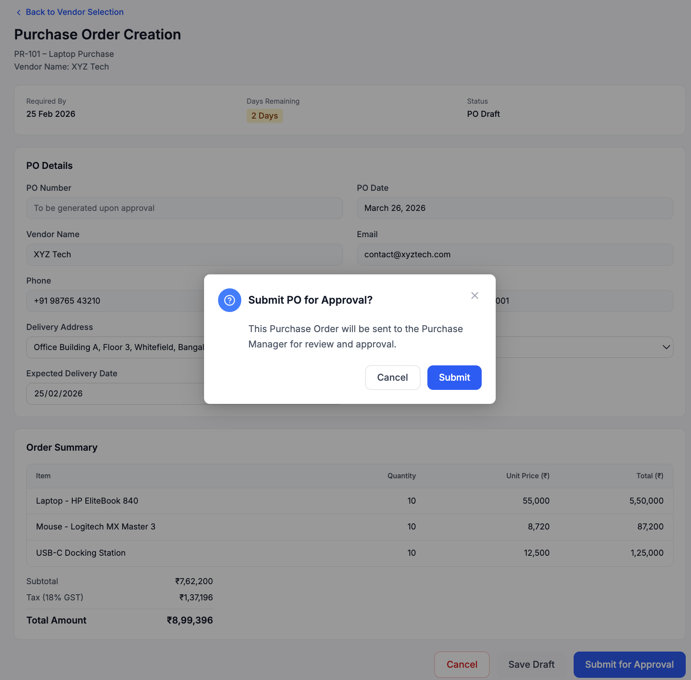
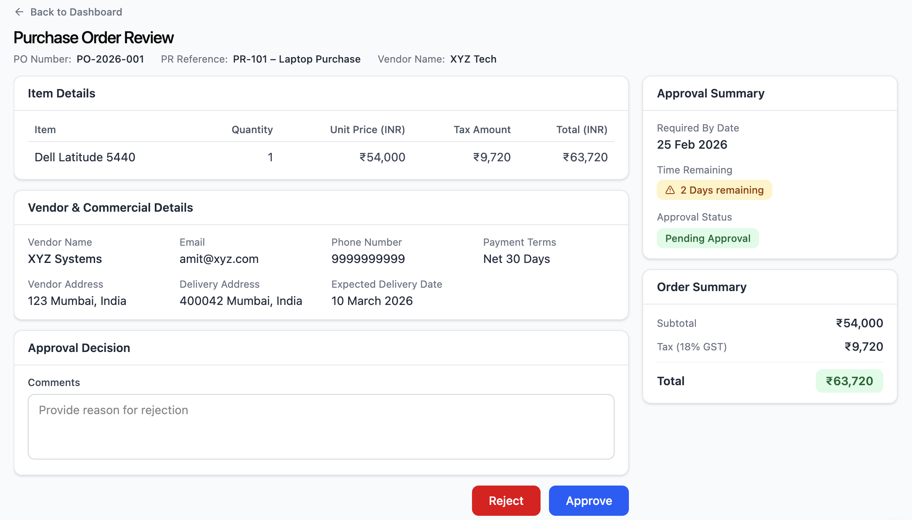
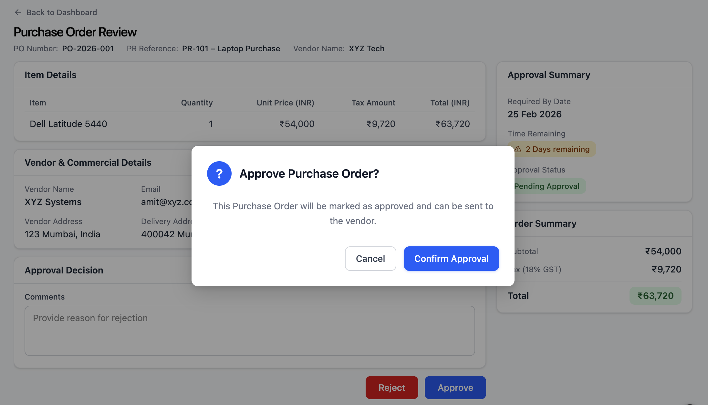

# Purchase Order Creation & Submission

---

## Overview

This module enables the Purchase Team to generate a formal Purchase Order (PO) based on the selected vendor’s approved quotation and submit it for managerial approval.

It ensures structured data capture, financial accuracy, and controlled workflow transition from procurement decision to approval.

---

## Screens Covered

- Purchase Order Creation
- Submit Purchase Order for Approval (Confirmation Modal)

---

# Screen: Purchase Order Creation

## Overview

The Purchase Order Creation screen allows the Purchase Team to create a PO using system-populated vendor and request data while capturing required commercial and delivery details.

This screen ensures that all financial calculations and business rules are enforced before submission.

---

## Wireframe

## Payment Terms Dropdown

---

## Header Section

Displays:

- Purchase Request Reference (PR ID & Title)
- Selected Vendor
- Required By Date
- Days Remaining (auto-calculated)
- Current PO Status (Draft)

### Logic

- Days Remaining is dynamically calculated based on Required By Date
- Status updates automatically based on workflow stage
- PO Number is generated only after submission

---

## PO Details Section

### System-Controlled Fields

- Vendor Name (auto-populated, read-only)
- Vendor Contact Details
- PO Date (auto-filled)
- PO Number (generated post submission)

### Editable Fields

- Delivery Address
- Payment Terms
- Expected Delivery Date

### Business Rule

- Vendor details cannot be modified at this stage to maintain data integrity

---

## Order Summary Section

Displays:

- Item Name
- Quantity
- Unit Price
- Calculated Subtotal
- Tax (based on predefined rules)
- Final Total Amount

### Automation

- All calculations are system-driven
- Tax is auto-computed
- No manual override allowed

### Purpose

- Ensures financial accuracy
- Maintains compliance
- Keeps cross-screen data consistency

---

## Action Controls

Available Actions:

- Save Draft
- Submit for Approval
- Cancel

### Workflow Logic

- Save Draft → Retains editable state
- Submit for Approval →
  - Locks financial values
  - Updates status to "Pending Approval"
  - Routes PO to Purchase Manager
  - Generates official PO Number

---

# Screen: Submit Purchase Order for Approval

## Overview

The Submit PO confirmation modal ensures that users explicitly confirm submission before triggering the approval workflow.

This prevents accidental submissions and reinforces workflow control.

---

## Wireframe

---

## Modal Structure

### Header

- Title: "Submit PO for Approval?"
- Close (X) option

### Body

Displays confirmation message:

- "This Purchase Order will be sent to the Purchase Manager for review and approval."

Optional Context:

- Vendor Name
- Total Amount

---

## Action Controls

- Cancel → Closes modal without changes
- Submit → Confirms submission

---

## System Behavior

On Submit:

- PO status updates to "Pending Approval"
- PO becomes non-editable
- Routed to Purchase Manager
- Official PO Number generated

On Cancel:

- Modal closes
- No changes applied

---

## Governance & Controls

- Submission is irreversible from user end
- Financial data is locked post submission
- Workflow transitions are system-driven
- Audit traceability is maintained

---

## Key Observations

- Prevents accidental submission through confirmation step
- Ensures data integrity before approval
- Maintains strict workflow control
- Supports audit and compliance requirements

---

# Purchase Order Creation & Approval

This module represents the final stage of the Procure-to-Pay process, where a Purchase Order is generated, reviewed, and approved before being sent to the vendor.

---

## 1. PO Review Screen

### Overview
The Purchase Manager reviews the submitted Purchase Order in detail before making an approval decision.

### Key Sections

#### PO Context Header
- PO Number
- Linked PR Reference
- Vendor Name
- Required By Date
- Status (Pending Approval)

#### Vendor & Delivery Details
- Vendor contact information
- Delivery address
- Payment terms
- Expected delivery date

#### Financial Summary
- Quantity
- Unit Price
- Tax (auto-calculated)
- Total Amount

---

## 2. Approval Decision

### Available Actions
- Approve
- Reject

### Decision Logic

**If Approved:**
- Status updates to *PO Approved*
- Purchase Team is notified
- “Send PO to Vendor” action is enabled

**If Rejected:**
- Mandatory rejection remarks required
- Status updates to *PO Rejected*
- PO returns for revision

---

## 3. Approval Modal

### Behavior
- Triggered on clicking “Approve”
- Confirms user intent before final submission

### Actions
- Cancel → closes modal
- Confirm Approval → finalizes approval

---

## 4. Governance & Controls

- PO cannot be edited at approval stage
- Financial values are system-controlled
- Approval decision is timestamped
- Approver identity is recorded
- Separation of duties enforced
