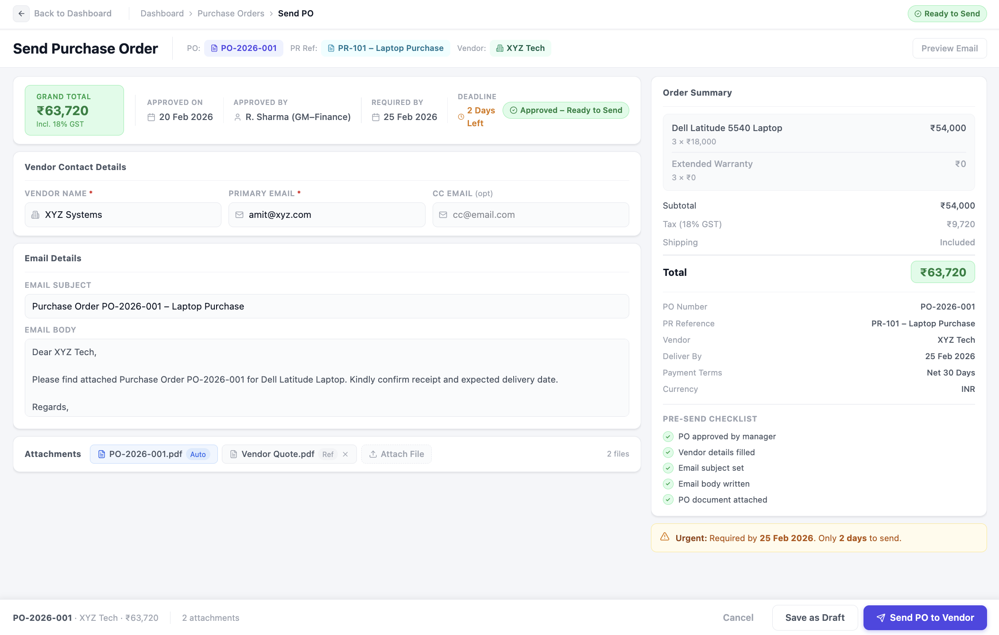
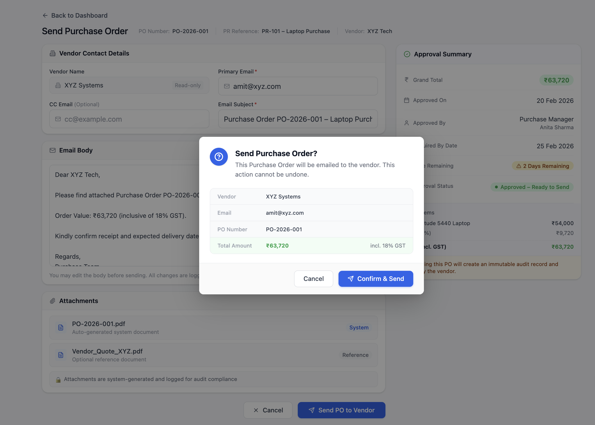

# Send Purchase Order

## Overview
This screen enables the Purchase Team to formally send the approved Purchase Order to the selected vendor via email.  
It represents the official vendor commitment stage in the procurement lifecycle.

---

## Wireframe

### Send Purchase Order Screen

### Confirmation Modal

---

## PO Summary Panel

### Displays:
- Grand Total  
- Approved On Date  
- Approved By  
- Required By Date (with dynamic days remaining indicator)  
- Status: **Approved – Ready to Send**

### Logic:
- Only POs in **“Approved – Ready to Send”** status can access this screen  
- Urgency is auto-calculated  
- Financial values are locked and non-editable  

---

## Vendor Contact Details

### Displays:
- Vendor Name  
- Primary Email  
- Optional CC Email  

### Logic:
- Vendor details are auto-populated from master data  

---

## Email Composition Section

### Includes:
- Email Subject (auto-generated but editable)  
- Pre-filled email body template requesting delivery confirmation  

### Logic:
- Subject cannot be blank  
- Template ensures standardized communication  
- Purchase Team may adjust message if required  

---

## Attachments Section

### Automatically attaches:
- System-generated PO PDF  
- Vendor quotation document (optional reference)  

### Control:
- PO document cannot be modified at this stage  

---

## Action Controls

### Buttons:
- Cancel  
- Send PO to Vendor  

### Workflow Logic:

#### Upon clicking “Send PO to Vendor”:
- Status updates to **PO Sent**  
- Timestamp is recorded  
- Vendor dispatch is logged  
- Purchase Team Dashboard updates  
- Warehouse Dashboard reflects status as **Awaiting Delivery**  

---

## Governance & Compliance

- Only approved POs can be sent  
- Financial details are locked  
- Dispatch action is audit logged  
- Ensures controlled vendor communication  

---
