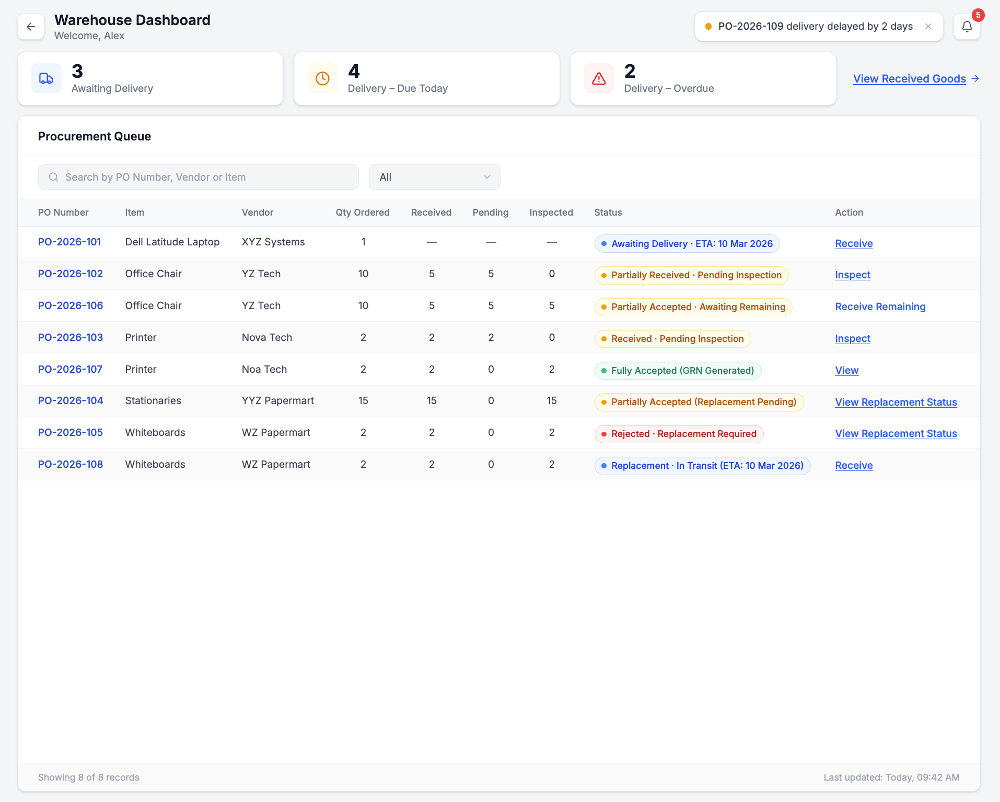

# Warehouse Dashboard

## Overview
The Warehouse Dashboard serves as the operational control center for managing physical deliveries against approved Purchase Orders. Once a PO is sent and accepted by the vendor, this screen enables the Warehouse team to track delivery timelines, record received quantities, perform inspections, generate GRNs, and initiate replacement workflows in case of discrepancies.

---

## Wireframe

### Warehouse Dashboard

---

## Dashboard Summary Cards

### Purpose:
These cards provide real-time delivery visibility and prioritization.

### Displays:
- Awaiting Delivery – POs accepted by vendor but not yet received  
- Delivery – Due Today – POs expected today  
- Delivery – Overdue – POs where ETA has passed  

### Logic:
- Cards dynamically update based on delivery timelines  
- Enables prioritization of urgent and overdue deliveries  

---

## Procurement Queue (Data Grid)

### Purpose:
The data grid provides detailed tracking of each PO.

### Key Columns:
- PO Number  
- Item  
- Vendor  
- Quantity Ordered  
- Received Quantity  
- Pending Quantity (Auto-calculated)  
- Inspected Quantity  
- Status  
- Action  

---

## Status & Action Logic

System status updates dynamically based on goods receipt and inspection:

### Delivery Stage:
- Awaiting Delivery → Action: **Receive**  
- Partially Received – Pending Inspection → Action: **Inspect**  
- Partially Accepted – Awaiting Remaining Delivery → Action: **Receive Remaining**  

### Inspection Stage:
- Received – Pending Inspection → Action: **Inspect**  
- Fully Accepted (GRN Generated) → Action: **View**  
- Partially Accepted (Replacement Pending) → Action: **View**  

### Replacement Flow:
- Rejected – Replacement Required → Action: **View Replacement**  
- Replacement – In Transit → Action: **Receive**  

---

## Automation & Controls

- Pending quantity auto-calculates after receipt entry  
- Status updates automatically based on inspection results  
- GRN is generated only for accepted quantities  
- Rejected quantities trigger replacement coordination with Purchase Team  
- ETA is displayed for delivery tracking  

---

## Workflow Context

This screen becomes active after:

**PO Sent → Vendor Accepted → Awaiting Delivery**

The Warehouse Dashboard manages the physical verification and acceptance stage before financial processing begins.

---

## Governance & Compliance

- All receipt and inspection actions are system logged  
- GRN generation is restricted to accepted quantities only  
- Replacement workflows are tracked and auditable  
- Ensures separation between procurement and warehouse operations  

---
