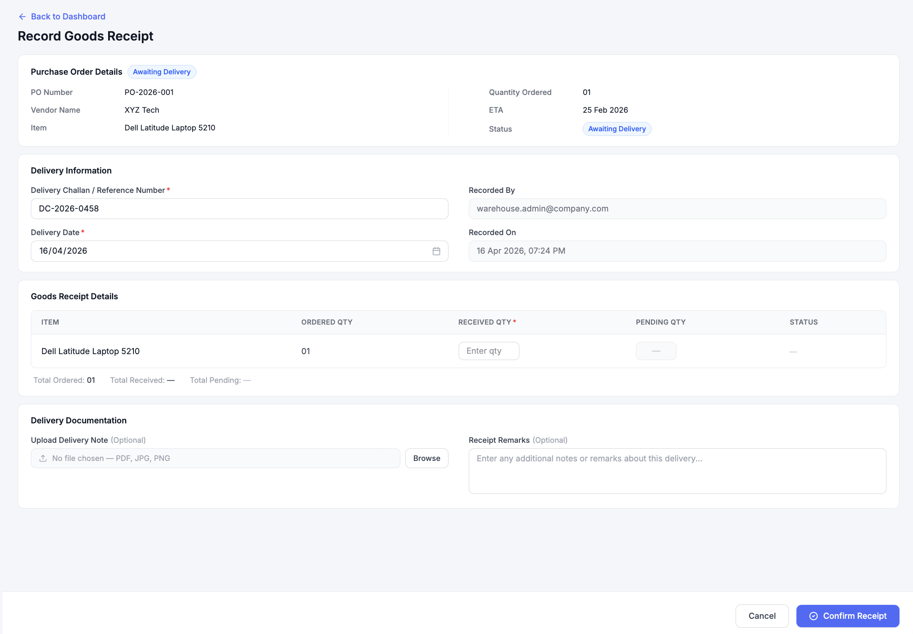

# Record Goods Receipt

## Overview
The Record Goods Receipt screen is used by the Warehouse team to formally record the physical delivery of goods against a Purchase Order. This step confirms that items have been received at the warehouse and transitions the PO from delivery tracking into the inspection stage.

---

## Wireframes

### Record Full Goods Receipt

### Confirm Full Goods Receipt

### Record Partial Goods Receipt

### Confirm Partial Goods Receipt

---

## Purchase Order Details (Read-Only Context)

### Purpose:
At the top, the system displays PO reference information to ensure correct validation before receipt is recorded.

### Displays:
- PO Number  
- Vendor Name  
- Item  
- Quantity Ordered  
- ETA  
- Current Status  

### Logic:
- Read-only view ensures no modification of PO data  
- Ensures warehouse user verifies the correct order before proceeding  

---

## Delivery Information

### User Inputs:
- Delivery Challan / Reference Number (Mandatory)  
- Delivery Date (Mandatory)  

### System Generated:
- Recorded By  
- Recorded On (System Date & Time)  

### Control:
- Mandatory fields must be completed before submission  
- Ensures audit traceability of goods receipt  

---

## Goods Receipt Section

### Displays:
- Ordered Quantity (Read-only)  
- Received Quantity (User Input)  
- Pending Quantity (Auto-calculated)  
- Status (Auto-updated)  

### System Validation:
- Received Quantity cannot exceed Ordered Quantity  
- Pending Quantity = Ordered – Received  
- Status updates automatically based on quantity entered  

---

## Delivery Documentation

### Optional Inputs:
- Upload Delivery Note (PDF / JPG / PNG)  
- Receipt Remarks  

### Purpose:
- Supports documentation and audit reference  
- Enables traceability of vendor shipment  

---

## Confirmation Logic

### On Clicking “Confirm Receipt”:

#### Full Receipt:
- If Received Quantity = Ordered Quantity  
  → Status updates to **Received – Pending Inspection**

#### Partial Receipt:
- If Received Quantity < Ordered Quantity  
  → Status updates to **Partially Received – Pending Inspection**

### System Behavior:
- User is redirected to the **Inspection Screen**  
- No GRN is generated at this stage  

---

## Workflow 

**Awaiting Delivery → Record Goods Receipt → Inspection → GRN / Replacement**

This ensures physical receipt is captured before inspection and financial processing.

---

## Automation & Controls

- Quantity validations enforced at system level  
- Status transitions are system-driven  
- Receipt entry is timestamped and user-tracked  
- Partial deliveries are supported and tracked separately  
- Ensures accurate downstream inspection and GRN generation  

---

## Governance & Compliance

- Receipt entries are audit logged  
- PO data remains read-only  
- Mandatory fields enforce completeness  
- Ensures separation of duties between procurement and warehouse  

---
