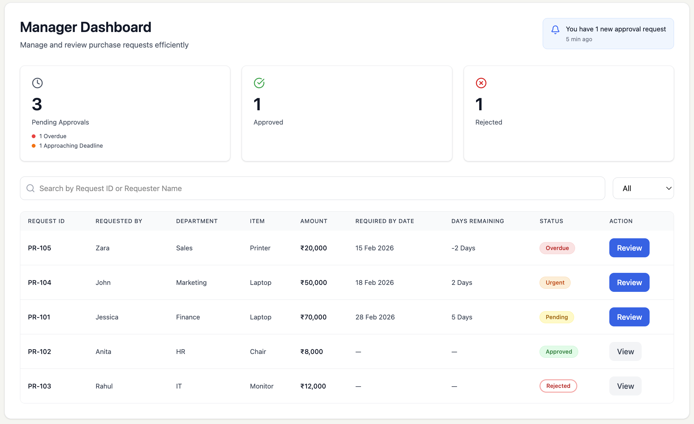
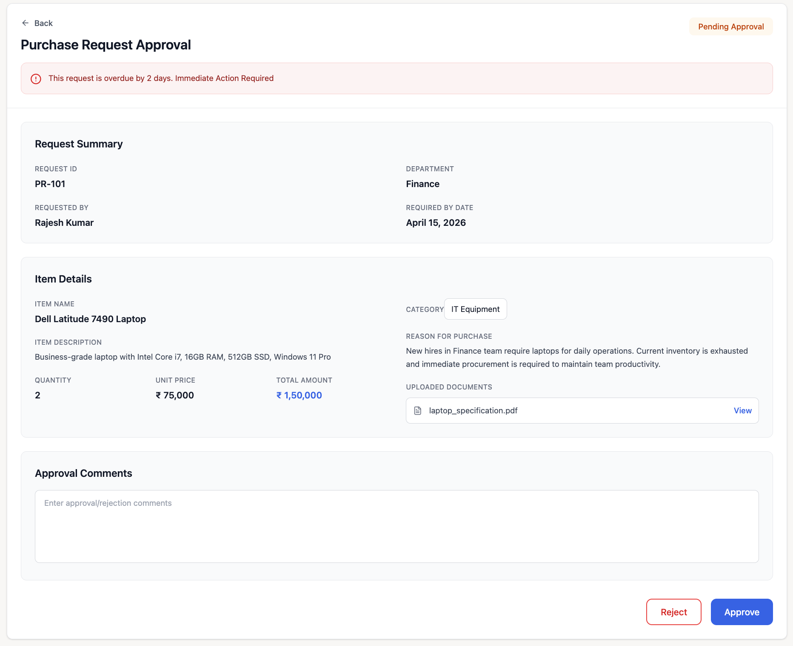

# Approval Module

---

## Screen 1: Approval Dashboard (Manager View)

### Overview

The Approval Dashboard provides managers with visibility into all Purchase Requests awaiting approval. It enables structured decision-making based on request details, urgency and timelines.

This screen acts as the control center for managers to review, prioritize, and take action on incoming requests.

---

### Wireframe

---

### Status Categories

Requests are categorized as:

- Pending Approval  
- Approved  
- Rejected  

The dashboard primarily focuses on actionable pending approvals.

---

### Key Functional Logic

- Only **submitted requests** appear in the approval queue  
- Requests display:
  - PR Number  
  - Requester Name  
  - Department  
  - Item  
  - Amount (₹ INR)  
  - Required By Date  
  - Days Remaining  
  - Status  

- **Days Remaining Logic:**
  - Calculated as: Required Date – Current Date  
  - Negative → Overdue  
  - Low days → Urgent  

- Managers can:
  - Search by Request ID or Requester Name  
  - Filter by status  

---

### Automation & Governance

- Approval routing is determined based on cost thresholds  
- Managers **cannot edit request details** (read-only view)  
- Approval moves request to next stage (Purchase Team)  
- Rejection requires a **mandatory reason**  
- Status transitions are system-driven  

---

### Workflow Transition

- Clicking **Review** → Opens PR Approval Detail Screen  
- Approved → Moves to RFQ stage  
- Rejected → Returns to requester with reason  

---

### Key Observations

- Dashboard prioritizes **pending and time-sensitive approvals**  
- Clear separation between actionable and completed items  
- Ensures governance before financial commitment  

---

---

## Screen 2: PR Approval Detail Screen

### Overview

The PR Approval Detail Screen enables managers to review complete request details and take an approval or rejection decision.

This screen ensures controlled authorization before procurement begins.

---

### Wireframe

---

### Information Displayed

The Manager can view:

- PR Number  
- Requester Details  
- Department  
- Item Name & Description  
- Quantity & Unit Price  
- Total Amount (auto-calculated)  
- Required By Date  
- Business Justification  
- Supporting Attachments  

All fields are **read-only**.

---

### Key Functional Logic

Managers can:

- Approve the request  
- Reject the request  

System behavior:

- Rejection requires a **mandatory reason input**  
- Approved requests move to **Purchase Team (RFQ stage)**  
- Rejected requests:
  - Move to "Rejected" status  
  - Notify the requester  

- PR details cannot be modified at this stage  

---

### Governance & Controls

- Approval routing follows predefined cost thresholds:
  - Within limit → Manager Level 1  
  - Above limit → Escalates to Manager Level 2  

- All decisions are:
  - Time-stamped  
  - Audit-tracked  

- Workflow transitions are system-controlled and cannot be overridden  

---

### Workflow Transition

- Approve → Moves to Purchase Team (RFQ)  
- Reject → Returns to requester with reason  
- Back → Returns to Approval Dashboard  

---

### Key Observations

- Strong control layer before procurement execution  
- Ensures accountability through audit logs  
- Prevents unauthorized edits during approval stage  

---
