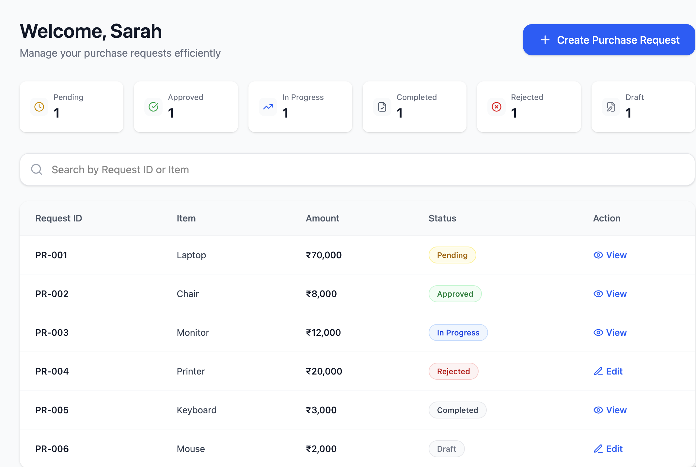

# Procurement Request Module

## Overview

The Procurement Request module serves as the starting point of the procurement process. It enables users to create, manage, and track purchase requests (PRs) before they enter the approval workflow.

This module ensures that all required information is captured accurately at the source, enabling structured downstream processing.

---

## Key Responsibilities

- Create purchase requests  
- Provide business justification  
- Attach supporting documents  
- Submit requests for approval  
- Track request status across stages  

---

## Screens Covered

- Procurement Request Dashboard  
- Create Purchase Request  

---

# Screen: Procurement Request Dashboard

## Overview

The Procurement Request Dashboard provides a consolidated view of all purchase requests created within the system. It enables tracking of request status, quick access to actions, and initiation of new purchase requests.

---

## Wireframe

---

## Layout and Sections

### 1. Header

- Welcome message  
- "Create Purchase Request" action  

### 2. Status Summary

- Pending  
- Approved  
- In Progress  
- Completed  
- Rejected  
- Draft  

### 3. Search

- Search by Request ID or Item  

### 4. Request Table

**Columns:**

- Request ID  
- Item  
- Amount (₹ INR)  
- Status  
- Action  

---

## System Logic

- Displays only requests created by the logged-in user  
- Status counts dynamically update based on request data  
- Table sorted by latest request  

---

## Status Logic

- Draft → Editable  
- Pending → Under approval  
- Approved → Moves to next stage  
- In Progress → Processing stage  
- Completed → Closed  
- Rejected → Editable  

---

## Action Logic

- Draft → Edit  
- Rejected → Edit  
- Others → View only  

---

## Business Rules

- Users can only view their own requests  
- Submitted requests cannot be edited  
- Status must align with workflow stage  

---

## Edge Cases

- No data → Empty state  
- Search mismatch → No results  
- Large dataset → Pagination  

---

## Workflow Transition

- Create Purchase Request → Opens form  
- View → Opens request details  
- Edit → Opens editable request  

---

# Screen: Create Purchase Request

## Overview

The Create Purchase Request screen enables users to initiate procurement by capturing item, financial, and business justification details.

This screen serves as the entry point into the approval workflow, ensuring all required data is validated before submission.

---

## Wireframe

---

## Layout and Sections

### 1. Request Details

- Request Date (auto-captured, read-only)  
- Request Title (required)  
- Department (dropdown)  
- Required By Date (required date picker)  

### 2. Item Details

- Category (required dropdown)  
- Item Name (required)  
- Item Description  
- Quantity (required numeric input)  
- Unit Price (₹ INR format, required)  

### 3. Financial Calculation

- Total Amount = Quantity × Unit Price  
- Auto-calculated and read-only  

### 4. Business Justification

- Mandatory multi-line input  

### 5. Attachments

- Optional upload  
- Formats: PDF, XLS, JPG, PNG  

### 6. Actions

- Save as Draft  
- Submit for Approval  

---

## System Logic

- Total Amount auto-calculated  
- Request Date system-generated  
- PR Number generated on submission  
- Draft remains editable  
- Submitted request becomes read-only  

---

## Business Rules

- Required date cannot be in the past  
- Quantity must be greater than zero  
- Unit price must be valid  
- Justification mandatory  

---

## Edge Cases

- Missing fields → blocked submission  
- Invalid values → error  
- Past date → restricted  
- Invalid file → rejected  

---

## Workflow Behavior

- Draft → Saved without validation  
- Submit → Routed to approval based on cost  

---

## Key Observations

- Ensures structured data capture  
- Prevents incomplete submissions  
- Maintains financial accuracy  
- Enables controlled workflow initiation  
