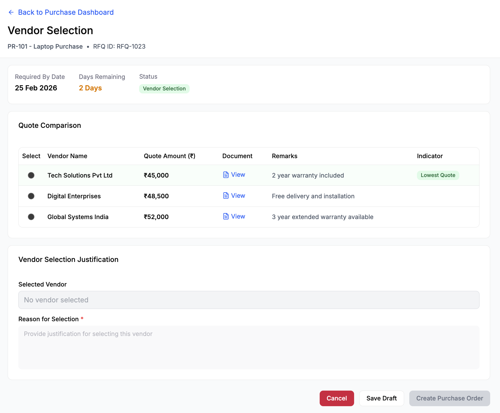

# Vendor Selection

## Module

Purchase Execution

---

## Overview

The Vendor Selection screen enables the Purchase Team to evaluate recorded vendor quotations and formally select a vendor for Purchase Order creation. This stage ensures structured comparison, informed decision-making, and mandatory justification for audit and compliance purposes.

---

## Workflow Context

RFQ Management → Vendor Selection → PO Creation

---

## Wireframe

---

## Quote Comparison View

The screen displays:

- Vendor Name  
- Quoted Amount  
- Quote Document  
- Remarks  
- Selection option (radio button)  

- The system highlights the **lowest quoted amount** for reference.

---

## Layout and Sections

### 1. Header

- Back to Purchase Dashboard (navigation link)  
- Page Title: Vendor Selection  
- Purchase Request Reference (e.g., PR-101 - Laptop Purchase)  
- RFQ ID  

---

### 2. RFQ Context Summary

Displays key details:

- Required By Date  
- Days Remaining (auto-calculated)  
- RFQ Status (e.g., Vendor Selection)  

> Days Remaining is dynamically calculated to provide timeline visibility.

---

### 3. Quote Comparison Table

Columns:

- Select (Radio button – single selection)  
- Vendor Name  
- Quote Amount (₹ INR)  
- Document (View link)  
- Remarks  

Features:

- Only one vendor can be selected  
- Lowest quote is visually highlighted  
- All vendors displayed are those with recorded quotes  

---

### 4. Vendor Selection Justification

Fields:

- Selected Vendor (auto-filled, read-only)  
- Reason for Selection (mandatory multi-line input)  

---

### 5. Actions

- Cancel  
- Save Draft  
- Create Purchase Order (Primary CTA)  

---

## System Logic

- Vendor list is fetched from RFQ Management (only vendors with recorded quotes)  
- Selecting a vendor updates the Selected Vendor field  
- Lowest quote is automatically identified and highlighted  
- Selected vendor’s quote is carried forward to PO  

---

## Selection Logic

- The Purchase Team selects one vendor for PO creation  
- Selection requires mandatory justification  
- Justification is captured for audit and compliance purposes  

---

## Validation Rules

- Vendor selection is mandatory  
- Justification is mandatory  
- "Create Purchase Order" is enabled only when:
  - A vendor is selected  
  - Justification is provided  

---

## Business Rules

- Only vendors with recorded quotes are eligible for selection  
- Only one vendor can be selected  
- Lowest quote is highlighted but not mandatory to select  
- Justification is required even if lowest quote is selected  

---

## Edge Cases

- No quotes recorded → Selection disabled  
- No vendor selected → Block progression  
- Missing justification → Block PO creation  
- Multiple vendors with same quote → No automatic selection  

---

## Workflow Behavior

- Save Draft → Saves selection without progressing  
- Create Purchase Order → Moves to PO Creation stage  
- Cancel → Returns to dashboard  

---

## Workflow Progression

Upon confirming vendor selection:

- RFQ status updates to **Vendor Selected**  
- The system enables PO Creation  
- No direct PO creation without vendor selection  

---

## Governance Controls

- Only vendors with recorded quotes are eligible for selection  
- Vendor selection cannot proceed without justification  
- Selected vendor’s quoted amount is auto-populated into the PO  
- Selection is timestamped for audit traceability  

---

## Key Observations

- Ensures structured vendor comparison  
- Enforces accountability through justification  
- Maintains auditability of procurement decisions  
- Prevents premature PO creation  
