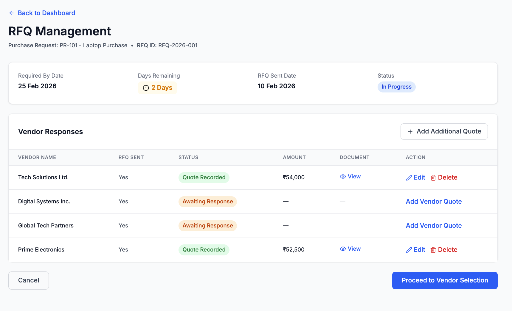

# RFQ Management

## Module

Purchase Execution

---

## Overview

The RFQ Management screen enables users to monitor vendor responses, record quotations, and control progression toward vendor selection. This ensures structured quote comparison before Purchase Order creation.

---

## Workflow Context

RFQ Creation → RFQ Management → Vendor Selection → PO Creation

---

## Wireframe

---

## RFQ Context (Header Section)

The header displays:

- Purchase Request Number  
- RFQ ID  
- Required By Date  
- Days Remaining (auto-calculated)  
- RFQ Sent Date  
- RFQ Status (e.g., In Progress)  

> Days Remaining is dynamically calculated based on the Required By Date to ensure timeline visibility.

---

## Vendor Responses Section

The Vendor Responses table includes:

- Vendor Name  
- RFQ Sent Status  
- Response Status  
- Quoted Amount  
- Uploaded Quote Document  
- Action  

- Vendors initially appear as **Awaiting Response**

---

## Layout and Sections

### 1. Header

- Back to Dashboard (navigation link)  
- Page Title: RFQ Management  
- PR reference and RFQ ID  
- Timeline indicators (Required Date, Days Remaining)  
- Status indicator (In Progress)  

---

### 2. RFQ Summary

- Required By Date  
- RFQ Sent Date  
- Days Remaining  
- Status  

---

### 3. Vendor Responses Table

- Displays all selected vendors  
- Tracks RFQ sent status  
- Captures vendor responses and quotes  
- Allows document viewing  

---

### 4. Actions

- Cancel  
- Proceed to Vendor Selection (Primary CTA)  

---

## System Logic

- RFQ details are auto-populated from RFQ Creation  
- Vendor list is carried forward from RFQ  
- RFQ status remains **In Progress** until manually advanced  
- Days remaining is auto-calculated  

---

## Quote Recording Logic

When a vendor quote is received:

- The Purchase Team records the quote amount  
- Supporting quotation document is uploaded  
- Status automatically updates to **Quote Recorded**  
- Quote status is system-controlled and cannot be manually overridden  

---

## Progression Control

- "Proceed to Vendor Selection" is enabled only when:
  - At least one vendor quote is recorded  
  - Required documentation is uploaded  

- Additional quotes can be recorded before proceeding  
- RFQ remains in **In Progress** state until manually advanced  

---

## Validation Rules

- Quote amount must be entered to mark response  
- Supporting document upload is required for quote recording  
- Vendor response cannot be marked complete without data  

---

## Business Rules

- RFQ must be sent before responses can be recorded  
- Multiple vendor quotes can be recorded  
- At least one valid quote is required to proceed  
- Vendor comparison happens before selection  

---

## Edge Cases

- No vendor response → Remains Awaiting Response  
- Missing quote data → Prevent progression  
- Missing document → Block quote recording  
- Delayed response → Reflected in Days Remaining  

---

## Workflow Behavior

- Quote Recorded → Moves toward Vendor Selection stage  
- Proceed to Vendor Selection → Navigates to next step  
- Cancel → Returns to dashboard  

---

## Workflow Progression

- RFQ Pending → RFQ In Progress  
- Quote recording → Moves to Awaiting Vendor Selection  
- Vendor selection → Triggers PO creation  

---

## Governance & Automation

- RFQ data auto-saves during updates  
- Quote entries are time-stamped for audit traceability  
- Workflow transitions are sequential and system-driven  
- Direct movement to PO creation is restricted without vendor selection  

---

## Key Observations

- Ensures structured vendor response tracking  
- Enables fair quote comparison  
- Prevents incomplete progression  
- Maintains auditability and control  
